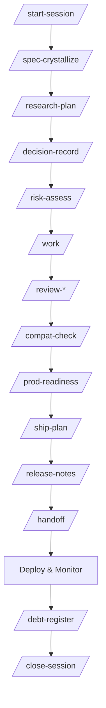
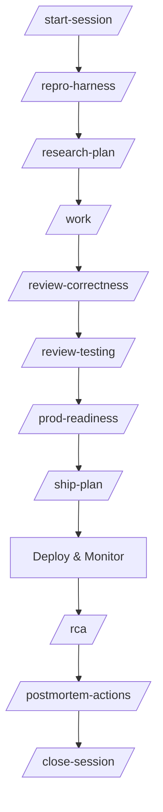
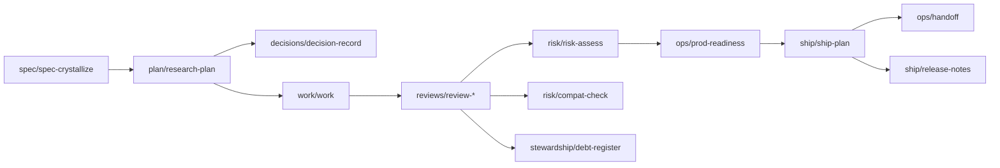

# Project Workflow and Claude Commands

This repo uses a **session-based** workflow for Claude (or any coding agent) that produces **durable, reviewable artifacts** under:

> `.claude/<session_slug>/**/*`

A **session** corresponds to a single workstream (one bug, one feature, one refactor, one incident response). Each session folder is self-contained and navigable.

---

## Why sessions

Sessions solve the two recurring problems with agent-assisted coding:

* **Orphaned artifacts**: plans/reviews get generated but are hard to find later.
* **Lost context**: the “why” disappears after code lands.

With sessions:

* Every artifact has a predictable home.
* The session README becomes a **table of contents**.
* The global `.claude/README.md` becomes a **registry** of all sessions.

---

## Quickstart

1. **Start a session**

Run `/start-session` with a natural language explanation:
```
/start-session
EXPLANATION: Need to add CSV bulk import with preview and duplicate detection
```

The command will infer work type, generate a session slug, and set up the folder structure.

2. **Generate the right entry artifacts**

After starting a session, you can omit `SESSION_SLUG` from subsequent commands (they'll use the most recent session):

* Bug/incident: `/repro-harness` → `/research-plan`
* Feature/greenfield: `/spec-crystallize` → `/research-plan`
* Refactor: `/research-plan` (plus early safety tests)

Example:
```
/spec-crystallize
INPUTS: Users need to upload CSV files with preview before committing to database
```

3. **Execute**

* `/work` in checkpoints.

4. **Review**

* Run relevant `/review-*` commands.

5. **Ship**

* `/risk-assess` (if meaningful risk) → `/prod-readiness` → `/ship-plan` → `/handoff`

6. **Close**

* `/close-session`

---

## Session structure

### `session_slug` rules

* lowercase, kebab-case
* must match: `^[a-z0-9]+(-[a-z0-9]+)*$`
* examples:

  * `checkout-500`
  * `csv-bulk-import`
  * `payments-state-refactor`
  * `incident-2026-01-14-auth-timeout`

### Folder layout

```
.claude/
  README.md                # global session index (registry)
  <session_slug>/
    README.md              # session table of contents (source of truth)

    spec/
    plan/
    decisions/
    work/
    reviews/
    risk/
    testing/
    ship/
    runbooks/
    ops/
    incidents/
    stewardship/
```

### What goes where

* **Spec**: `spec/`
* **Plan**: `plan/`
* **Decisions**: `decisions/`
* **Work log**: `work/`
* **Reviews**: `reviews/`
* **Risk/Compatibility**: `risk/`
* **Testing strategy**: `testing/`
* **Ship artifacts**: `ship/`
* **Runbooks**: `runbooks/`
* **Ops readiness / handoff**: `ops/`
* **Incident artifacts**: `incidents/`
* **Debt and follow-ups**: `stewardship/`

---

## Global index

The global registry lives at:

> `.claude/README.md`

Each session is one line:

```md
- [csv-bulk-import](./csv-bulk-import/README.md) — 2026-01-14: CSV bulk import with preview + idempotent commit
```

`/start-session` must add/update this line (no duplicates).
Sessions are listed in chronological order (oldest first, newest last).
`/close-session` appends a status tag: `[DONE] | [PAUSED] | [ABANDONED]`.

---

## Session README conventions

`.claude/<session_slug>/README.md` should contain:

* summary + context links
* constraints + non-goals
* success criteria
* default review chain
* “next commands to run”
* artifact checklist with relative links

It is the **source of truth** for navigating the session.

---

## Commands

### Session lifecycle

* **`/start-session`**: bootstraps `.claude/<session_slug>/` + updates global index
* **`/close-session`**: finalizes session README + updates global index status tag

### Spec & alignment

* **`/spec-crystallize`** → `.claude/<session>/spec/spec-crystallize.md`
* **`/scope-triage`** → `.claude/<session>/plan/scope-triage.md`
* **`/decision-record`** → `.claude/<session>/decisions/decision-record.md`

### Research / plan / execution

* **`/research-plan`** → `.claude/<session>/plan/research-plan.md`
* **`/work`** → `.claude/<session>/work/work.md`

### Reviews (`/review-*`) → `.claude/<session>/reviews/`

Core quality:

* `/review-overengineering`
* `/review-correctness`
* `/review-maintainability`
* `/review-style-consistency`
* `/review-testing`
* `/review-docs`

Risk & safety:

* `/review-security`
* `/review-privacy`
* `/review-supply-chain`
* `/review-reliability`

Performance & scale:

* `/review-performance`
* `/review-cost`
* `/review-scalability`

Architecture & API:

* `/review-architecture`
* `/review-api-contracts`
* `/review-dx`

Data:

* `/review-migrations`
* `/review-data-integrity`

Operability:

* `/review-observability`
* `/review-logging`

Frontend & product:

* `/review-frontend-performance`
* `/review-accessibility`
* `/review-ux-copy`

Infra / delivery:

* `/review-ci`
* `/review-infra`
* `/review-release`

Also:

* `/review-refactor-safety`
* `/review-frontend-accessibility`
* `/review-backend-concurrency`
* `/review-infra-security`

### Risk, compatibility, testing strategy

* **`/risk-assess`** → `.claude/<session>/risk/risk-assess.md`
* **`/compat-check`** → `.claude/<session>/risk/compat-check.md`
* **`/test-matrix`** → `.claude/<session>/testing/test-matrix.md`

### Shipping

* **`/ship-plan`** → `.claude/<session>/ship/ship-plan.md`
* **`/release-notes`** → `.claude/<session>/ship/release-notes.md`

### Ops readiness

* **`/prod-readiness`** → `.claude/<session>/ops/prod-readiness.md`
* **`/slo-check`** → `.claude/<session>/ops/slo-check.md`
* **`/telemetry-audit`** → `.claude/<session>/ops/telemetry-audit.md`
* **`/handoff`** → `.claude/<session>/ops/handoff.md`

### Incidents

* **`/repro-harness`** → `.claude/<session>/incidents/repro-harness.md`
* **`/rca`** → `.claude/<session>/incidents/rca.md`
* **`/postmortem-actions`** → `.claude/<session>/incidents/postmortem-actions.md`

### Stewardship

* **`/debt-register`** → `.claude/<session>/stewardship/debt-register.md`
* **`/refactor-followups`** → `.claude/<session>/stewardship/refactor-followups.md`

---

## Required: session awareness in every command

All commands must accept:

* `SESSION_SLUG: <...>` (optional - inferred if not provided)

**SESSION_SLUG inference:**
* If `SESSION_SLUG` is not provided, read `.claude/README.md` and use the most recent session (last entry in "Sessions" list - sessions are in chronological order)
* If `.claude/README.md` doesn't exist or has no sessions, stop with: "No sessions found. Run `/start-session` first."
* This allows a streamlined workflow: after running `/start-session`, users can omit `SESSION_SLUG` from all subsequent commands

All commands must:

* Print a **Save as** path: `.claude/<session_slug>/<bucket>/<artifact>.md`
* Add minimal frontmatter (`command`, `session_slug`, `date`, `scope`, `target`, `related`)
* Update `.claude/<session_slug>/README.md` with a link + one-line summary

---

## Workflow diagrams

### Feature / refactor path



### Incident / bug path



---

## Standard review chains

Use these to keep review coverage consistent:

* **Bug fix:** `review-correctness` → `review-testing` → `review-security` (if sensitive surface)
* **Refactor:** `review-refactor-safety` → `review-maintainability` → `review-testing`
* **New API feature:** `review-api-contracts` → `review-security` → `review-reliability` → `review-observability`
* **DB changes:** `review-migrations` → `review-data-integrity` → `review-reliability`

---

## Artifact relationships

### Typical feature session graph



---

## Minimal frontmatter for artifacts

Each artifact file begins with:

```markdown
---
command: /research-plan
session_slug: csv-bulk-import
date: 2026-01-14
scope: pr
target: <PR_URL or base..head>
related:
  spec: ../spec/spec-crystallize.md
  work: ../work/work.md
---
```

Keep `related` small and accurate. Prefer relative paths.

---

## Done criteria

A session is “done” when:

* success criteria are met
* ship plan (if needed) exists
* handoff exists for operationally relevant changes
* global index updated with `[DONE]`
* session README has closure notes via `/close-session`

---

If you want this README to be enforceable, the next step is adding a lightweight PR checklist that asks for:

* session slug
* links to `.claude/<session>/plan/research-plan.md`
* links to relevant reviews
* link to ship plan (if risk is medium/high)
